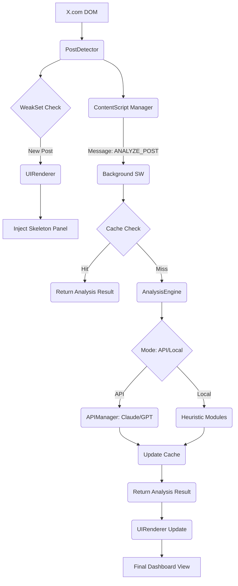

# 🏗️ Context Lens System Architecture

## Overview
Context Lens for X (Twitter) follows a modular, event-driven architecture designed for Chrome Manifest V3. The system is split into three main layers: **Detection**, **Analysis**, and **Rendering**.

---

## 🗺️ High-Level Component Map

---

## 🛠️ Data Flow Breakdown

### 1. Detection Layer (`post-detector.js`)
- **MutationObserver**: Subscribes to changes in the `body` of X.com.
- **Debounce Mechanism**: Waits for a 400ms pause in DOM activity before scanning to ensure efficiency.
- **Selector Strategy**: Uses `article[data-testid="tweet"]` as the root entry point.
- **WeakSet Pattern**: Tracks processed DOM elements to avoid duplicate injections without causing memory leaks.

### 2. Analysis Engine (`analysis-engine.js`)
- **Dual-Mode Dispatch**: Orchestrates the choice between API and local analysis.
- **API Manager**: Handles the lifecycle of external requests, including rate limiting and network error recovery.
- **Local Fallback**: Implements high-speed heuristic logic for sentiment, toxicity, and AI probability.

### 3. State Management (`storage.js` & `cache-manager.js`)
- **Chrome Storage API**: Uses `local` for persistent caching and `sync` for user settings.
- **Multi-Layer Cache**:
  - **Memory Cache (Map)**: Instant retrieval for current session.
  - **Persistent Cache (IDB/Local)**: 24-hour TTL for across-session efficiency.

### 4. Rendering Layer (`ui-renderer.js`)
- **Atomic CSS**: Styles are scoped to the `.context-lens-panel` namespace to avoid style bleed from X.com.
- **State-Driven UI**: Dynamically switches between `loading`, `success`, and `error` data-attributes to drive CSS animations.

---

## 🔒 Security Posture
- **Content Security Policy**: Strict MV3 compliance (No remote code execution).
- **Sanitization Layer**: All incoming AI-generated text is processed through a sanitization step before being displayed.
- **Principle of Least Privilege**: Only requests necessary permissions (storage, activeTab, alarms).

---

## 📈 Performance Budget
- **Initialization Time**: < 30ms.
- **DOM Injection Overhead**: < 5ms per post.
- **Memory Footprint**: Average 15MB - 30MB overhead.
- **Lazy Processing**: Only analyzes posts currently entering the viewport (via IntersectionObserver integration).
